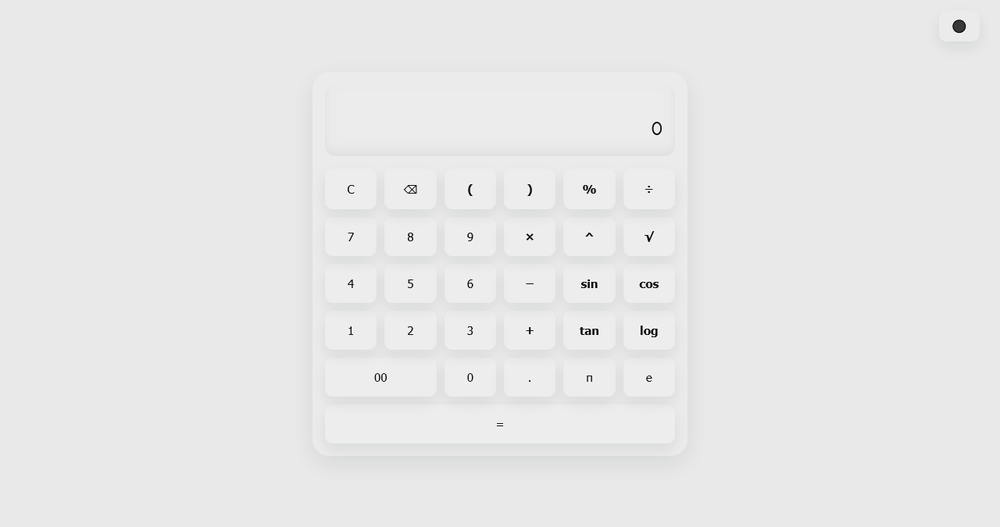

# Scientific Calculator 🧮

<p> 


</p>


---
---

_A powerful, modern **scientific calculator** built for the web with dark/light mode support, **responsive design**, and **advanced math functions**._

---
---

## 💡 Features

- Basic arithmetic: `+`, `−`, `×`, `÷`
- Scientific functions: `sin`, `cos`, `tan`, `log`, `√`, `^` (power)
- Constants: `π`, `e`
- Percentage, decimals, parentheses support
- Dark/Light mode toggle
- Memory-safe clear (`C` button clears all history)
- Backspace (`⌫`) support
- **Repeat** last operation with `=`
- Full **keyboard** and mouse support
- **Responsive** design for both desktop and mobile

---
---

## 🎨 Demo

<details>
<summary>Click to expand Screenshots</summary>

### Light Mode



### Dark Mode


</details>

---

## 🌐 Live Demo

[](https://abdurrahman101bd.github.io/Scientific-Calculator)

---

## ⚡ Installation

1. **Clone the repository:**

```bash
git clone https://github.com/abdurrahman101bd/Scientific-Calculator.git
```
2. **Navigate to the project folder:**
```bash
cd Scientific-Calculator
```
3. **Open index.html in your browser:**
```bash
index.html
```

---

## 🛠️ Usage Instructions

1. Clone the **repository** or **download the ZIP**.
2. Open `index.html` in your **web browser**.
3. Use the **on-screen buttons** or your **keyboard** to perform calculations.
4. **Toggle dark/light mode** using the ⚫/⚪ button at the top-right.

---

## 🎨 UI & Theme

- Supports both **dark** and **light** modes.
- Modern button styling with CSS variables:
  - `--bg`, `--text`, `--accent`, `--panel`, `--btn-bg`, `--btn-shadow`
- Grid layout for keys.
- Special buttons:
  - `double` spans two columns
  - `eq` spans full row
- **Fully responsive design for mobile and desktop**

---

## 🛠 Technologies Used

💻 HTML5

🎨 CSS3 (responsive & dark mode)

⚡ Vanilla JavaScript

---

## 👨‍💻 Contributing

1. Fork the repository.
2. Add new features or fix **bugs**.
3. Submit a **Pull Request**.

---

## ⚡ Tips

- **Large numbers or complex expressions may be limited by browser capabilities**.
- Keyboard shortcuts:
  - `Enter` = `=`
  - `Backspace` = `⌫`
  - `Escape` = `C`
- Mobile-friendly: **responsive** viewport meta tag included.
---

## 📄 License

This project is licensed under the [MIT License](LICENSE).

---

## 👤 Author

[](https://github.com/abdurrahman101bd)
[](mailto:abdurrahman101bd@gmail.com)

---

### 🌍 Social Links

Connect with me on **social** platforms:

[](https://github.com/abdurrahman101bd)[](https://www.linkedin.com/in/abdurrahman101bd)[](https://x.com/abdurrahman101b)  [](https://www.facebook.com/abdurrahman101bd)  

---

⌛ Enjoy your **Scientific Calculator!**

---


